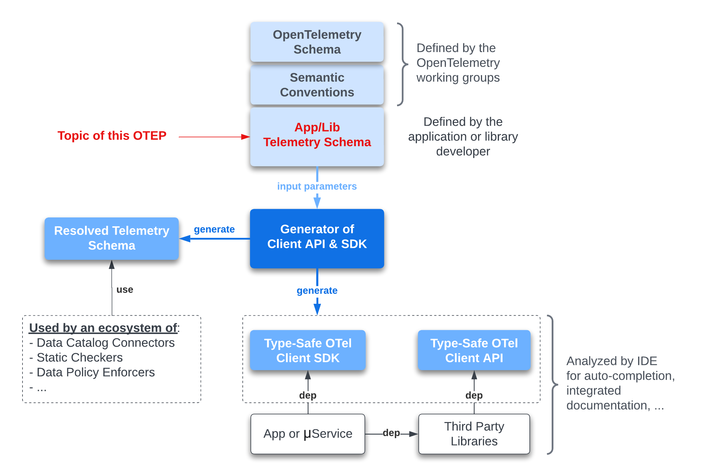
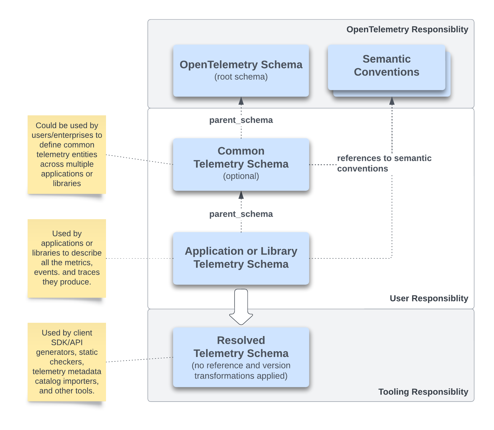

# Application/Library Telemetry Schema

**Author**: Laurent Querel, F5 Inc.

**Keywords**: Telemetry Schema, Semantic Convention, Client API, Client SDK,
Code Generator, Telemetry Backend, Data Governance, Data Privacy.

**Related OTEPs**: [OTEP0152](https://github.com/open-telemetry/oteps/blob/main/text/0152-telemetry-schemas.md), [OTEP0202](https://github.com/open-telemetry/oteps/blob/main/text/0202-events-and-logs-api.md).

## Table of contents

- [Motivation](#motivation)
- [Application/Library Telemetry Schema](#applicationlibrary-telemetry-schema-1)
  - [Resource](#resource)
  - [Instrumentation Library](#instrumentation-library)
  - [Attributes](#attributes)
  - [Metrics](#metrics)
  - [Metric groups](#metric-groups)
  - [Events](#events)
  - [Spans](#spans)
  - [Span Events](#span-events)
  - [Span Links](#span-links)
  - [Tagging](#tagging)
  - [Versioning and Transformation Rules](#versioning-and-transformation-rules)
    - [Update in the spans section](#update-in-the-spans-section)
    - [Creation of the metric groups section](#creation-of-the-metric-groups-section)
    - [Creation of the events section](#creation-of-the-events-section)
  - [Examples of Client API generated from a Telemetry Schema](#examples-of-client-api-generated-from-a-telemetry-schema)
- [Implementation Recommendations](#implementation-recommendations)
- [Risks and Mitigations](#risks-and-mitigations)
- [Trade-offs and Mitigations](#trade-offs-and-mitigations)
- [Future Versions and Interoperability](#future-versions-and-interoperability)
- [Prior Art and Alternatives](#prior-art-and-alternatives)
- [Open Questions](#open-questions)
- [Future possibilities](#future-possibilities)
- [Appendix A - Links](#appendix-a---links)
- [Appendix B - Schema Examples](#appendix-b---schema-examples)

## Motivation

OpenTelemetry is swiftly establishing itself as the go-to standard for telemetry. 
With its expansive ecosystem of generic client SDKs, developers can seamlessly
report metrics, logs, events, and traces from their applications or libraries in
a manner that feels native to their chosen programming language. Yet, several
challenges remain:
- **Scalability and Aging Issues**: As applications mature and developer teams
grow, the consistency of telemetry instruments tends to degrade (i.e.
inconsistencies in the naming and definition of attributes, metrics, traces, and
events).
- **Data Model Issues**: Client instrumentation and protocol constraints often
force complex applications to downscale their multivariate metrics to a
univariate model, most often leading to suboptimal performance.
- **Schema Evolution Challenges**: The telemetry sphere feels the absence of
efficient tools specifically designed to handle schema evolution and versioning.
The instrumentation is deeply integrated into the application and library code,
which makes the automated discovery of the produced telemetry data complex.
While [OTEP0152](https://github.com/open-telemetry/oteps/blob/main/text/0152-telemetry-schemas.md)
assists in defining transformations between different versions of semantic
conventions, it doesn't specifically address metrics, events, and spans schema
evolution defined at the application or library level.
- **Data Governance Gaps**: Despite strides in telemetry, a seamless integration
with data governance and privacy systems is still on the horizon. There are no
or few solutions for automatically extracting and analyzing the metadata
associated with the telemetry of applications and libraries.
- **Performance Overheads**: A significant downside to generic telemetry
instrumentation is the latency it can introduce, especially in systems that
operate in real-time. This delay arises due to the inherent layers of
abstraction.

To effectively address these challenges, this OTEP outlines the concept of
Application/Library Telemetry Schema that extends [OTEP0152](https://github.com/open-telemetry/oteps/blob/main/text/0152-telemetry-schemas.md). 
This schema will serve as the basis for developing a client API/SDK generator
and facilitating the creation of additional supportive tooling. The foundation
of this generator rests on the following key features.

**Key features**:
1. **Schema-first Design & OTel Semantic Convention Integration**: 
  - Uniform Instrumentation: Guarantee consistency in naming and typing across
all telemetry dimensions, ensuring standardized reporting.
  - Instrumentation & Data Governance Alignment:
    - Proactively detect and catalog the telemetry data being exposed.
    - Introduce field-level annotations, forging a bridge between
instrumentation, data governance and privacy. This establishes a base for policy
engines to manage aspects such as encryption, localization, obfuscation and more.
  - Ecosystem Evolution: Foster a new set of tools designed for efficient schema
evolution management, prevention of misuse, comprehensive policy enforcement,
and specialized documentation.
2. **Code Generation** (inspired by Protobuf):
  - Vendor-Neutral & Language Agnostic Approach: Generate code based on an 
application/library telemetry schemas.
  - Seamless IDE Integration: Offer a type-safe API tailored for IDE
integration, enhancing auto-completion and improving the overall developer
experience. This includes developing superior tooling and static checks to
prevent misuse and errors.
  - Performance Optimization: Focus on CPU, memory, network, and compression
ratio improvements by eliminating unnecessary abstraction layers and natively
leveraging the new OTel Arrow Protocol in addition to the standard OTLP protocol.
3. **Native Support for Multivariate time-series**:
  - Add native support for multivariate time series to the client API/SDK,
eliminating the need for applications to turn them into an expensive set of
univariate metrics.
4. **Compatibility with the existing ecosystem**:
  - Ensure a seamless integration with the existing client APIs and SDKs.
  - Support both the standard OTLP protocol and the OTel Arrow Protocol.

This OTEP builds upon the existing Telemetry Schema [OTEP0152](https://github.com/open-telemetry/oteps/blob/main/text/0152-telemetry-schemas.md)
and proposes an extension to include what was referred to as the "current state schema"
in the [Future Possibilities](https://github.com/open-telemetry/oteps/blob/main/text/0152-telemetry-schemas.md#future-possibilities)
section. Additionally, this OTEP creates an explicit bridge between the telemetry
schema and [Semantic Conventions](https://github.com/open-telemetry/build-tools/blob/main/semantic-conventions/syntax.md). 



> **Important Note: This OTEP focuses on the Application/Library Telemetry
Schema. The detail of the client API and SDK generation is not part of this
OTEP and will be covered by a separate project. However, few examples of type-safe
Client API are provided in this OTEP to illustrate the benefits of this approach.**

The next section describes the Application/Library Telemetry Schema in details.

## Application/Library Telemetry Schema

The Telemetry Schema, as detailed in [OTEP0152](https://github.com/open-telemetry/oteps/blob/main/text/0152-telemetry-schemas.md),
addresses the question: "How can we ensure independent evolution among semantic
conventions, telemetry sources, and telemetry consumers?". However, it doesn't
provide specific details about the telemetry entities an application or library
might produce. [OTEP0152](https://github.com/open-telemetry/oteps/blob/main/text/0152-telemetry-schemas.md)
primarily acted as an adaptation layer, allowing schema changes in semantic
conventions without disrupting any component within a telemetry pipeline.

This new OTEP serves as an enhanced extension of the existing Telemetry Schema
detailed in [OTEP0152](https://github.com/open-telemetry/oteps/blob/main/text/0152-telemetry-schemas.md).
It proposes the addition of descriptions for metrics, events, and spans emitted
by an application or library. This extension was previously referred to as the
"current state schema" in the [Future Possibilities](https://github.com/open-telemetry/oteps/blob/main/text/0152-telemetry-schemas.md#future-possibilities)
section of the OTEP0152.

The following diagram illustrates the relationship between the OpenTelemetry
Schema, the Application/Library Telemetry, and the semantic conventions. It also
shows who is responsible for defining them and how they are utilized.



The extended Telemetry Schema introduced three new fields:
- **parent_schema_url** (optional): this field specifies the URL of the parent
schema, which is typically the official OpenTelemetry Telemetry schema (version
[1.21.0](https://opentelemetry.io/schemas/1.21.0) at the time of writing this OTEP). 
This parent schema may contain sections outlined in this OTEP, as well as those
specified in [OTEP0152](https://github.com/open-telemetry/oteps/blob/main/text/0152-telemetry-schemas.md).
- **semantic_conventions** (optional): this section specifies the list of [semantic
conventions](https://github.com/open-telemetry/semantic-conventions/tree/main/model) 
to import to facilitate the resolution of references associated with attributes
and metrics found in the schema section.
- **schema**: this section defines the telemetry schema for an application or a
library. See details below.

> Note 1: reusing existing semantic conventions is recommended to expedite the definition
of an application/library telemetry schema and to make it more consistent with
the rest of the OpenTelemetry ecosystem.

> Note 2: `file_format`, `schema_url` and `versions` fields are inherited from
the existing Telemetry Schema (see [OTEP0152](https://github.com/open-telemetry/oteps/blob/main/text/0152-telemetry-schemas.md))
and convey the same semantics.

The version number of the `file_format` is 1.2.0, as the proposed changes are
merely compatible additions to version 1.1.0 defined in [OTEP0152](https://github.com/open-telemetry/oteps/blob/main/text/0152-telemetry-schemas.md).

Here is the structure of the application/library telemetry schema file.

```yaml
# Defines the file format. MUST be set to 1.2.0.
file_format: 1.2.0

# Optional field specifying the schema url of the parent schema. The current
# schema overrides the parent schema.
# Usually the parent schema is the official OpenTelemetry Telemetry schema
# containing the versioning and their corresponding transformations.
# However, it can also include any of the new fields defined in this OTEP.
parent_schema_url: <URL>

# The Schema URL that this file is published at.
schema_url: https://mycompany.com/schemas/1.0.0

# List of semantic conventions to imports
semantic_conventions:
  - url: <URL>

# Definition of the telemetry schema for an application or a library.
schema:
  tags:
    # Tags annotating the schema.
    # See tagging section below.
  
  # Only used when a Client SDK is generated.
  resource:
    attributes:
      # Definitions of all resource attributes for the current application.
      # List of references or inline definitions. See details below.
    tags:
      # Tags annotating the resource.
      # See tagging section below.

  # Instrumentation library name and version.
  # MUST be used both by applications and libraries.  
  instrumentation_library:
    name: "my-service"
    version: "1.0.0"
    tags:
      # Tags annotating the instrumentation library.
      # See tagging section below.

  resource_metrics:
    attributes:
      # Common attributes shared across metrics and metric groups.
      # List of references or inline definitions. See details below.
    metrics:
      # Definitions of all metrics this application or library generates (classic
      # univariate OTel metrics).
      # List of references or inline definitions. See details below.
    metric_groups:
      # Definitions of all multivariate metrics this application or library
      # generates.
      # List of references or inline definitions. See details below.
    tags:
      # Tags annotating the resource metrics.
      # See tagging section below.

  resource_events:
    attributes:
      # Common attributes shared across events (implemented as log records).
      # List of references or inline definitions. See details below.
    events:
      # Definitions of structured events this application or library generates.
      # List of references or inline definitions. See details below.
    tags:
      # Tags annotating the resource events.
      # See tagging section below.

  resource_spans:
    attributes:
      # Common attributes shared across spans.
      # List of references or inline definitions. See details below.
    spans:
      # Definitions of all spans this application or library generates.
      # List of references or inline definitions. See details below.
    tags:
      # Tags annotating the resource spans.
      # See tagging section below.

# Definitions for each schema version in this family.
# Note: the ordering of versions is defined according to semver
# version number ordering rules.
# This section is described in more details in the OTEP 0152 and in a dedicated
# section below.
# https://github.com/open-telemetry/oteps/blob/main/text/0152-telemetry-schemas.md
versions:
  <version_number_last>:
    # definitions for this version. 
  <version_number_previous>:
    # definitions for previous version
    ...
  <version_number_first>:
    # Defines the first version.
```

> Future Evolution: As of now, logs are not incorporated into the Application/Library
Telemetry Schema. However, there is potential to include them in the future,
particularly to facilitate the instrumentation of structured logs.

### Resource

The resource section defines the resource attributes for an application. This
section is optional and is only used when a Client SDK is generated.

```yaml
  resource:
    attributes:
      # See details in the attribute section below.
    tags:
      # Tags annotating the resource.
      # See tagging section below.
```

> Important note: Defining this section for a library is an error.

### Instrumentation Library

This optional section defines the name and version of the instrumentation
library. This section can be used both by applications and libraries.

Generated Client SDKs or Client APIs will report this information in the 'scope'
field."

### Attributes

Attributes follow the OpenTelemetry semantic convention [syntax](https://github.com/open-telemetry/build-tools/blob/main/semantic-conventions/syntax.md).
They can be defined either inline (using `id`) or as a reference to a semantic
convention (using `ref` or `attribute_group_ref`).

Each "attributes" has the following structure:

```yaml
attributes:
  # Reference to an attribute defined in one of the imported
  # semantic conventions.
  - ref: <attribute id>
    # Other valid attribute fields defined here will override the imported
    # semantic convention attribute (except `id` and `type`).
    tags:
      # tags can be added to an attribute reference.
      # see tagging section below.

  # Reference to an attribute group defined in one of the imported
  # semantic conventions.
  - attribute_group_ref: <attribute group id>
    # Other valid attribute group fields here will override the imported
    # group (except `id` and `type`).
    tags:
      # tags can be added to an attribute_group reference.
      # see tagging section below.

  # Declaration of a new local attribute.
  # The `id` field is mandatory and must be unique within the current schema.
  - id: <unique attribute id>
    # All the mandatory attribute fields.
    # Other optional attribute fields.
    tags:
      # see tagging section below.
```

A `ref` field must be used to reference an existing semantic convention attribute.
It is possible to override some of the attribute fields defined in the semantic
convention by defining them in the current schema in the same object as the `ref`
field (see example below). 

An `attribute_group_ref` field must be used to reference an existing semantic convention
attribute group. It is possible to override some of the attribute group fields 
defined in the semantic convention by defining them in the current schema in the
same object as the `attribute_group_ref` field (see example below).

An `id` field must be used to define a new local attribute. Any of the fields
defined in the semantic convention can be used to define a new local attribute
(see example below). This `id` must be unique within the current schema.

The following example shows how to override some of the fields defined in the
semantic convention and how to define a new local attribute.

```yaml
attributes:
  # Reference to the `address` attribute (prefix `server`) defined in
  # https://github.com/open-telemetry/semantic-conventions/blob/main/model/server.yaml
  # No overriding.
  - ref: server.address
    
  # Reference to the `port` attribute (prefix `server`) defined in
  # https://github.com/open-telemetry/semantic-conventions/blob/main/model/server.yaml
  # The requirement_level is overridden.
  - ref: server.port
    requirement_level: required
    
  # Reference to the `attributes.http.common` attribute group (prefix `http`) defined in
  # https://github.com/open-telemetry/semantic-conventions/blob/main/model/http-common.yaml
  # No overriding.
  - attribute_group_ref: http.attributes.http.common
    
  # Reference to the `attributes.http.server` attribute group (prefix `http`) defined in
  # https://github.com/open-telemetry/semantic-conventions/blob/main/model/http-common.yaml
  # The requirement_level for the `server.address` attribute is overridden.
  - attribute_group_ref: http.attributes.http.server
    attributes:
      - ref: server.address
        requirement_level: required
 
  # Definition of a new local attribute.   
  - id: login
    type: string
    requirement_level: required
    brief: The user login.
    tags:
      privacy.sensitivity: PII
      provenance: USER_INPUT
```

> Override rule: All fields can be overridden except for the `id` and `type` 
fields. This rule applies to all the override examples in this OTEP.

### Metrics

Metrics follow the OpenTelemetry semantic convention [syntax](https://github.com/open-telemetry/build-tools/blob/main/semantic-conventions/syntax.md). They can be
defined either inline (using `metric_name`) or as a reference to a semantic
convention (using `ref`).

Each "metrics" has the following structure:

```yaml
  resource_metrics:
    metrics:
      # Reference to a metric defined in one of the imported
      # semantic conventions.
      - ref: <metric id defined in an imported semantic convention>
          # Other valid metric fields defined here will override the imported
          # semantic convention.
        tags:
          # tags can be added to a metric reference.
          # see tagging section below.
        
      # Declaration of a new local metric.
      - metric_name: <unique metric name>
          # All the mandatory metric fields.
          # Other optional metric fields.  
        tags:
          # tags can be added to a metric.
          # see tagging section below.
    tags:
      # tags can be added to a group of metrics.
      # see tagging section below.
```

A `ref` field must be used to reference an existing semantic convention metric.
It is possible to override some of the metric fields defined in the semantic
convention by defining them in the current schema in the same object as the `ref`
field (see the example below).

A `metric_name` field must be used to define a new local metric. Any of the fields
defined in the semantic convention can be used to define a new local metric (except
for `id` and `type` fields). The `metric_name` must be unique within the current
schema. See the example below.

The following example shows how to override some of the fields defined in the
semantic convention and how to define a local metric.

```yaml
  resource_metrics:
    metrics:
      # Reference to the `metric.http.server.request.duration` metric defined in
      # https://github.com/open-telemetry/semantic-conventions/blob/main/model/metrics/http.yaml
      # A `note` field is added to the metric definition.
      - ref: metric.http.server.request.duration
        note: |
          This histogram is updated every 5 seconds.
          
      # Definition of a new local metric.
      - metric_name: pipeline.queue.size
        brief: The size of the pipeline queue.
        instrument: gauge
        unit: "By"
        attributes:
          - ref: server.address
            requirement_level: required
```

Important Note: In addition to the `ref`, `attribute_group_ref` and `id` fields
in the `attributes` section, it's also possible to make reference to the 
attributes of a semantic convention `metric_group`, see details below.

```yaml
  resource_metrics:
    metrics:
      # Reference to the `metric.http.server.request.duration` metric defined in
      # https://github.com/open-telemetry/semantic-conventions/blob/main/model/metrics/http.yaml
      # A `note` field is added to the metric definition.
      - ref: metric.http.server.request.duration
        note: |
          This histogram is updated every 5 seconds.
          
      # Definition of a new local metric.
      - metric_name: pipeline.queue.size
        brief: The size of the pipeline queue.
        instrument: gauge
        unit: "By"
        attributes:
          # All existing options described in the attribute section above are
          # supported.

          # Reference to a `metric_group` attributes is also supported. 
          - metric_group_ref: <metric group id>
```

### Metric groups

A metric group refers to a collection of metrics that share a common set of
attributes. Essentially, a metric group represents a **multivariate time-series**
observed over a specific timeframe. 

Each "metric_groups" has the following structure:

```yaml
  resource_metrics:
    metric_groups:
      - id: <unique metric group id>
        # All the mandatory metric fields.
        # Other optional metric fields.
        
        # Shared attributes across all metrics defined in this group.
        attributes: <see attribute section defined in the metric section>

        tags:
          # tags can be added to a metric group.
          # see tagging section below.
        
        metrics:
          - ref: <metric id defined in an imported semantic convention>
            # Other valid metric fields defined here will override the imported
            # semantic convention.
            tags:
              # tags can be added to a metric reference.
              # see tagging section below.
          - metric_name: <unique metric name>
            # All the mandatory metric fields.
            # Other optional metric fields. 
            tags:
              # tags can be added to a metric.
              # see tagging section below.
    tags:
      # tags can be added to a group of metrics.
      # see tagging section below.
```

The concept of multivariate time series is not natively supported by the OTLP
protocol. In this case, the client SDK will automatically transform the
`metric_group` into a set of univariate metrics. However, if the OTel Arrow
protocol is used, the `metric_group` will be directly represented without
undergoing any transformation.

### Events

The [OTEP0202](https://github.com/open-telemetry/oteps/blob/main/text/0202-events-and-logs-api.md)
has introduced the concept of standalone events as a special type of log records.
Logs have mandatory severity level as a first-class parameter that events do not
have, and events have a mandatory name that logs do not have. Events are also
structured whereas logs are usually not.

Examples of standalone events:
- RUM events (client-side instrumentation)
- Recording kubernetes events

The `events` field has the following structure:

```yaml
  resource_events:
    events:
      - event_name: <string>
        domain: <string>
        attributes: <see attribute section>
        tags:
          # tags can be added to an event.
          # see tagging section below.
    tags:
      # tags can be added to a group of events.
      # see tagging section below.
```

The `event_name` is the name given to the event and it's mandatory.

The `domain` is an optional domain name that serves as a namespace for the event
name. The `domain` is used to avoid name collisions between events. With this 
structure, an event name is unique within a domain. 

The `attributes` field is optional and it's used to define the attributes of the
event. See details in the attribute section above. 

Internal details: The event name and domain will be attributes in the `LogRecord`
defined using semantic conventions.

### Spans

The `spans` section defines the spans emitted by an application or a library and
has the following structure:

```yaml
  resource_spans:
    spans:
      - span_name: <unique span name>
        kind: <span kind>
        attributes: <see attribute section>
        events: <see event section>
        links: <see link section>
        tags:
          # tags can be added to a span.
          # see tagging section below.
    tags:
      # tags can be added to a group of spans.
      # see tagging section below.
```

The `span_name` MUST be unique within the application (or library) telemetry 
schema file (including inherited spans from the optional parent schema).

The `kind` field is optional, and it's used to define the span kind. The following
values are supported:
- `unspecified` (default)
- `internal`
- `server`
- `client`
- `producer`
- `consumer`

`events` and `links` fields are optional and are defined below.

### Span Events

Span events are defined as a list of events. Each event has the following 
structure:

```yaml
        events:
          - event_name: <string>
            attributes: <see attribute section> 
            tags:
              # tags can be added to a span event.
              # see tagging section below.
```

The `event_name` MUST be unique within the span.

### Span Links

Span links are defined as a list of links. Each link has the following structure:

```yaml
        links:
          - link_name: <string>
            attributes: <see attribute section>
            tags:
              # tags can be added to a span link.
              # see tagging section below.
```

The `link_name` MUST be unique within the span.

### Tagging 

Tagging is used as a general annotation mechanism for any part of the schema.
This annotation mechanism can be used for various purposes such as the
definition of sensitive data (in terms of privacy, security), provenance,
attribution, etc.

A tag is a key/value pair of strings. There are no restrictions on the content
of the key or the value beyond the maximum number of characters (TBD). Multiple
tags can be associated with the same object within the schema. The number of 
tags per object is limited to x (TBD). These tags are retained within the
resolved schema to be utilized by certain tools consuming these resolved
schemas. For instance, a data catalog system might use these tags to
automatically record attributes that are likely to contain private or secret
data.

The declaration of tags is optional and has the following structure:

```yaml
  tags:
    <tag_key_1>: <value>
    <tag_key_2>: <value>
    # ...
    <tag_key_n>: <value>    
```

Example of tags users could use:

- sensitivity: pii
- sensitivity: phi
- data_classification: restricted
- semantic_type: email
- semantic_type: first_name
- owner: <email>
- provenance: browser_sensor

> Open Question: Should we establish a common codification for tags, similar to
> the semantic conventions used for attributes and metrics?

### Versioning and Transformation Rules

Transformation rules for schema evolution are defined in the `versions` section.
This OTEP extends the existing transformation rules defined in [OTEP0152](https://github.com/open-telemetry/oteps/blob/main/text/0152-telemetry-schemas.md)
as follows:

- New transformation rules are added to support the new telemetry schema
dimensions, i.e., metric group, event name, and span name. For now, only renaming
transformations are supported.
- Transformations defined in a child `versions` section override the ones
defined in the parent schemas. For example, if an attribute is renamed both in
the current schema and in the parent schema, the renaming defined in the current
schema will be used.
- Once all the local transformations are applied, the transformations defined in
the parent schemas are recursively applied, except for those overridden at a
child level.

In summary, child schemas subsume parent schemas transformation rules.

In this OTEP, application and third party library schemas don't interact with
each other. A future OTEP could define how to handle the interaction between
application and third party library schemas (e.g. how to handle the case where
an application wants to rename an attribute defined in a third party library).

An example of Application Telemetry schema versioning is provided [here](#examples-of-application-telemetry-schema-versioning).

#### Update in the spans section

The structure of the `spans` section (in versions) now includes a `rename_spans`
field to rename one or several spans.

```yaml
    spans:
      changes:
        - rename_attributes:
            attribute_map:
              # see details in the OTEP 0152.
        - rename_spans:
            name_map:
              # The keys are old span name used in the previous versions, the
              # values are the new span name to use in the current version.
```

#### Creation of the metric groups section

The structure of the `metric_groups` section (in versions) is defined as follows:

```yaml
    metric_groups:
      changes:
        - rename_groups:
            name_map:
            # Map of key/values. The keys are the old metric group name used in
            # the previous versions, the values are the new metric group name to
            # use in the current version.
```

#### Creation of the events section

The structure of the `events` section (in versions) is defined as follows:

```yaml
    events:
      changes:
        - rename_attributes:
            attribute_map:
            # Map of key/values. The keys are the old attribute name used in
            # the previous versions, the values are the new attribute name to
            # use in the current version.
        - rename_events:
            name_map:
            # The keys are old event name used in the previous versions, the
            # values are the new event name to use in the current version.
        - rename_domains:
            name_map:
            # The keys are old domain name used in the previous versions, the
            # values are the new domain name to use in the current version.
```

#### Examples of Application Telemetry Schema versioning

In the following example, the application telemetry schema specifies the
transformations to apply to convert the version 1.0.0 to the version 1.1.0 (and
the opposite transformation to convert the version 1.1.0 to the version 1.0.0).

```yaml
file_format: 1.2.0
parent_schema_url: https://opentelemetry.io/schemas/1.21.0
schema_url: https://mycompany.com/schemas/1.1.0

semantic_conventions:
  - url: https://raw.githubusercontent.com/open-telemetry/semantic-conventions/main/model/url.yaml
  - url: https://raw.githubusercontent.com/open-telemetry/semantic-conventions/main/model/http-common.yaml
  - url: https://raw.githubusercontent.com/open-telemetry/semantic-conventions/main/model/client.yaml
  - url: https://raw.githubusercontent.com/open-telemetry/semantic-conventions/main/model/exception.yaml
  - url: https://raw.githubusercontent.com/open-telemetry/semantic-conventions/main/model/server.yaml
  - url: https://raw.githubusercontent.com/open-telemetry/semantic-conventions/main/model/network.yaml
  - url: https://raw.githubusercontent.com/open-telemetry/semantic-conventions/main/model/metrics/http.yaml
  - url: https://raw.githubusercontent.com/open-telemetry/semantic-conventions/main/model/metrics/jvm-metrics.yaml

schema:
  resource:
    attributes:
      - id: environment
        value: PROD

  instrumentation_library:
    name: "my-service"
    version: "1.2.3"

  resource_metrics:
    metric_groups:
      - id: app.jvm  
        attributes:
          - ref: server.address
            requirement_level: required
          - ref: server.port
        metrics: 
          - ref: jvm.thread.count
          - ref: jvm.class.loaded
          - ref: jvm.cpu.recent_utilization

  resource_events:
    events:
      - event_name: trx
        domain: http
        attributes:
          - ref: server.address
          - ref: server.port
          - ref: http.response.status_code
            requirement_level: required
          - ref: network.protocol.name
          - ref: network.protocol.version
          - ref: url.scheme
          - id: url_host
            type: string
            brief: The host of the request
            requirement_level: required

  resource_spans:
    spans:
      - span_name: http_request  
        attributes:
          - ref: server.address
          - ref: server.port
          - ref: server.socket.address
          - ref: server.socket.port
          - ref: client.address
          - ref: client.port
          - ref: client.socket.address
          - ref: client.socket.port
          - ref: url.scheme
          - id: url_host
            type: string
            brief: The host of the request
            requirement_level: required
        events:
          - id: error
            attributes:
              - ref: exception.type
              - ref: exception.message
              - ref: exception.stacktrace

versions:
  1.1.0:
    metric_groups:
      changes:
        - rename_groups:
            name_map:
              app.jvm: application.jvm
    events:
      changes:
        - rename_attributes:
            attribute_map:
              url_host: url.host
        - rename_events:
            name_map:
              trx: transaction
    spans:
      changes:
        - rename_attributes:
            attribute_map:
              url_host: url.host
        - rename_spans:
            name_map:
              http_request: http.request
```

Based on the above schema, a telemetry consumer can convert telemetry data from
version 1.1.0 to version 1.0.0.

### Examples of Client API generated from a Telemetry Schema

Application Telemetry Schema:
    
```yaml
file_format: 1.2.0
parent_schema_url: https://opentelemetry.io/schemas/1.21.0
schema_url: https://mycompany.com/schemas/1.0.0

semantic_conventions:
  - url: https://raw.githubusercontent.com/open-telemetry/semantic-conventions/main/model/url.yaml
  - url: https://raw.githubusercontent.com/open-telemetry/semantic-conventions/main/model/http-common.yaml
  - url: https://raw.githubusercontent.com/open-telemetry/semantic-conventions/main/model/client.yaml
  - url: https://raw.githubusercontent.com/open-telemetry/semantic-conventions/main/model/exception.yaml
  - url: https://raw.githubusercontent.com/open-telemetry/semantic-conventions/main/model/server.yaml
  - url: https://raw.githubusercontent.com/open-telemetry/semantic-conventions/main/model/network.yaml
  - url: https://raw.githubusercontent.com/open-telemetry/semantic-conventions/main/model/metrics/http.yaml
  - url: https://raw.githubusercontent.com/open-telemetry/semantic-conventions/main/model/metrics/jvm-metrics.yaml

schema:
  resource:
    attributes:
      - id: environment
        value: PROD

  instrumentation_library:
    name: "my-service"
    version: "1.2.3"

  resource_metrics:
    metric_groups:
      - id: app.jvm  
        attributes:
          - ref: server.address
            requirement_level: required
          - ref: server.port
        metrics: 
          - ref: jvm.thread.count
          - ref: jvm.class.loaded
          - ref: jvm.cpu.recent_utilization

  resource_events:
    events:
      - event_name: transaction
        domain: http
        attributes:
          - ref: server.address
          - ref: server.port
          - ref: http.response.status_code
            requirement_level: required
          - ref: network.protocol.name
          - ref: network.protocol.version
          - ref: url.scheme
          - id: url.host
            type: string
            brief: The host of the request
            requirement_level: required

  resource_spans:
    spans:
      - span_name: http.request  
        attributes:
          - ref: server.address
          - ref: server.port
          - ref: server.socket.address
          - ref: server.socket.port
          - ref: client.address
          - ref: client.port
          - ref: client.socket.address
          - ref: client.socket.port
          - ref: url.scheme
          - id: url.host
            type: string
            brief: The host of the request
            requirement_level: required
        events:
          - id: error
            attributes:
              - ref: exception.type
              - ref: exception.message
              - ref: exception.stacktrace
        # links:
```

**Go Client API usage**:

The following example shows how the application can report the 3 JVM related
metrics defined in the `app.jvm` metric group in a single call.

```go
appJvm := meter.AppJvm()

appJvm.Report(
    meter.AppJvmMetricGroup{
        JvmThreadCount:          10,
        JvmClassLoaded:          100,
        JvmCpuRecentUtilization: 60,
    },
    meter.ServerAddress("10.122.32.12")
)
```

The same code but with the optional attributes.

```go
appJvm := meter.AppJvm()

appJvm.ReportWithOptAttrs(
    meter.AppJvmMetricGroup{
        JvmThreadCount:          10,
        JvmClassLoaded:          100,
        JvmCpuRecentUtilization: 60,
    },
    meter.ServerAddress("10.122.32.12")
    meter.AppJvmOptAttrs{
        ServerPort:             8080,
    },
)
```

The following example show how the application can report a `transaction` event.
```go
eventer.EventTransaction(
	eventer.HttpResponseStatusCode(200),
	eventer.UrlHost("http://xyz.com/abc"))
```

The same example but with some optional attributes.

```go
eventer.EventTransaction(
    eventer.HttpResponseStatusCode(200),
    eventer.UrlHost("http://xyz.com/abc"),
	eventer.TransactionOptAttrs{
	    ServerAddress:          "10.45.34.23",
	    ServerPort:             80,
    	NetworkProtocolName:    "http",
    	NetworkProtocolVersion: "2.0",
	})
```

Finally the following example shows how the application can report a `http.request`
span.

```go
span := tracer.StartHttpRequest(tracer.UrlHost("localhost"))

// Add some optional attributes, add an event, sets the status and ends the span.
// Attribute and Status methods return the span, allowing chaining.
span.AttrServerAddress("localhost").
    AttrServerPort(80).
    Event(tracer.ErrorEvent{
        ExceptionMessage: "An internal error occurred",
    }).
    Status(tracer.Ok).
    End()
```

The same example but with some optional attributes.

```go
// ========================================================================
// Another example of tracer.
// This time the optional parameters are also passed as parameters.
span = tracer.StartHttpRequestWithOptAttrs(
    tracer.UrlHost("localhost"),
    tracer.HttpRequestOptAttrs{
        ServerPort: 80,
        UrlScheme:  "https",
        // other optional attributes are not defined and will be set to
        // their default value.
    })

// It's also to specify another optional attribute after the span has
// been created.
span.AttrServerAddress("localhost").
    Status(tracer.Ok).
    End()
```

**Rust Client API usage**:

The following example shows how the application can report the 3 JVM related
metrics defined in the `app.jvm` metric group in a single call. 

Optional attributes are represented with an `Option` type.

```rust
let mut app_jvm = otel::meter::AppJvm();
app_jvm.report(
    AppJvmMetrics {
        jvm_thread_count: 10,
        jvm_class_loaded: 50,
        jvm_cpu_recent_utilization: 60,
    },
    AppJvmAttrs {
        server_address: "localhost".into(),
        server_port: Some(8080),
    },
);
```

The following example shows how to report the `http.request` span from a Rust
application.

```rust
// Starts a new span with the required attributes.
let mut span = otel::tracer::start_http_request(
    HttpRequestAttrs {
        url_host: "10.34.23.67".into(),
    });

// Specifies some optional attributes.
span.attr_url_scheme("https".into());
span.attr_client_port(443);

// Add an event to the span.
span.event(HttpRequestEvent::Error {
    exception_type: None,
    exception_message: Some("an error message".into()),
    exception_stacktrace: None,
});

// Set the status of the span.
span.status(Status::Ok);

// End the span. After this call, the span is not longer
// accessible.
span.end();
```

Resolved Application Telemetry Schema:

```yaml
```

## Implementation Recommendations

-- WIP -- 

Describe the rules to resolve the app/lib telemetry schema.
- Download the parent schema if defined.
- Download the semantic conventions if defined.
- Resolve all the references to semantic conventions.
- Apply the transformations defined in the parent schema.
- Apply the overrides defined in the schema.

Explain how to build type-safe client API.

## Risks and Mitigations

TBD

## Trade-offs and Mitigations

TBD

## Future Versions and Interoperability

TBD

## Prior Art and Alternatives

TBD

## Open Questions

TBD

## Future possibilities

TBD

Eco-system

## Appendix A - Links

- Telemetry Schema [Specification](https://opentelemetry.io/docs/specs/otel/schemas/).
- Telemetry Schema [File Format](https://opentelemetry.io/docs/specs/otel/schemas/file_format_v1.1.0/).
- Semantic Convention [Specification](https://github.com/open-telemetry/build-tools/tree/v0.21.0/semantic-conventions/syntax.md).
- Repository of semantic convention [models](https://github.com/open-telemetry/semantic-conventions/tree/main/model).

## Appendix B - Schema Examples

The following telemetry schema describes two spans (`client.http.request` and
`server.http.request`) and makes use of the semantic conventions defined in the
OpenTelemetry Semantic Conventions repository to reuse standardised attributes.

```yaml
file_format: 1.2.0
parent_schema_url: https://opentelemetry.io/schemas/1.21.0
schema_url: https://mycompany.com/schemas/1.0.0
semantic_conventions:
  - url: https://raw.githubusercontent.com/open-telemetry/semantic-conventions/main/model/resource/os.yaml
  - url: https://raw.githubusercontent.com/open-telemetry/semantic-conventions/main/model/client.yaml
  - url: https://raw.githubusercontent.com/open-telemetry/semantic-conventions/main/model/exception.yaml
  - url: https://raw.githubusercontent.com/open-telemetry/semantic-conventions/main/model/server.yaml
  - url: https://raw.githubusercontent.com/open-telemetry/semantic-conventions/main/model/trace/feature-flag.yaml

schema:
  resource:
    attributes:
      - resource_ref: os

  instrumentation_library:
    name: "my-service"
    version: "1.0.0"

  resource_spans:
    spans:
      - span_name: client.http.request
        attributes:
          - attribute_group_ref: client
        events:
          - event_name: error
            attributes:
              - span_ref: exception
          - event_name: feature_flag
            attributes:
              - event_ref: feature_flag
      - span_name: server.http.request
        attributes:
          - attribute_group_ref: server
        events:
          - event_name: error
            attributes:
              - span_ref: exception
          - event_name: feature_flag
            attributes:
              - event_ref: feature_flag
```

After resolution, i.e. elimination of all the references, the schema looks like:

```yaml
file_format: 1.2.0
parent_schema_url: https://opentelemetry.io/schemas/1.21.0
schema_url: https://mycompany.com/schemas/1.0.0
schema:
  resource:
    attributes:
    - id: os.version
      type: string
      brief: |
        The version string of the operating system as defined in [Version Attributes](/docs/resource/README.md#version-attributes).
      examples:
      - 14.2.1
      - 18.04.1
      requirement_level: recommended
      note: ''
    - id: os.build_id
      type: string
      brief: Unique identifier for a particular build or compilation of the operating system.
      examples:
      - TQ3C.230805.001.B2
      - '20E247'
      - '22621'
      requirement_level: recommended
      note: ''
    - id: os.name
      type: string
      brief: Human readable operating system name.
      examples:
      - iOS
      - Android
      - Ubuntu
      requirement_level: recommended
      note: ''
    - id: os.type
      type:
        allow_custom_values: true
        members:
        - id: windows
          value: windows
          brief: Microsoft Windows
          note: null
        - id: linux
          value: linux
          brief: Linux
          note: null
        - id: darwin
          value: darwin
          brief: Apple Darwin
          note: null
        - id: freebsd
          value: freebsd
          brief: FreeBSD
          note: null
        - id: netbsd
          value: netbsd
          brief: NetBSD
          note: null
        - id: openbsd
          value: openbsd
          brief: OpenBSD
          note: null
        - id: dragonflybsd
          value: dragonflybsd
          brief: DragonFly BSD
          note: null
        - id: hpux
          value: hpux
          brief: HP-UX (Hewlett Packard Unix)
          note: null
        - id: aix
          value: aix
          brief: AIX (Advanced Interactive eXecutive)
          note: null
        - id: solaris
          value: solaris
          brief: SunOS, Oracle Solaris
          note: null
        - id: z_os
          value: z_os
          brief: IBM z/OS
          note: null
      brief: The operating system type.
      requirement_level: required
      note: ''
    - id: os.description
      type: string
      brief: |
        Human readable (not intended to be parsed) OS version information, like e.g. reported by `ver` or `lsb_release -a` commands.
      examples:
      - Microsoft Windows [Version 10.0.18363.778]
      - Ubuntu 18.04.1 LTS
      requirement_level: recommended
      note: ''
  instrumentation_library:
    name: my-service
    version: 1.0.0
  resource_spans:
    spans:
    - span_name: client.http.request
      attributes:
      - id: client.socket.address
        type: string
        brief: Client address of the socket connection - IP address or Unix domain socket name.
        examples:
        - /tmp/my.sock
        - 127.0.0.1
        requirement_level:
          recommended: If different than `client.address`.
        note: |
          When observed from the server side, this SHOULD represent the immediate client peer address.
          When observed from the client side, this SHOULD represent the physical client address.
      - id: client.address
        type: string
        brief: Client address - domain name if available without reverse DNS lookup, otherwise IP address or Unix domain socket name.
        examples:
        - /tmp/my.sock
        - 10.1.2.80
        requirement_level: recommended
        note: |
          When observed from the server side, and when communicating through an intermediary, `client.address` SHOULD represent the client address behind any intermediaries (e.g. proxies) if it's available.
      - id: client.socket.port
        type: int
        brief: Client port number of the socket connection.
        examples:
        - 35555
        requirement_level:
          recommended: If different than `client.port`.
        note: |
          When observed from the server side, this SHOULD represent the immediate client peer port.
          When observed from the client side, this SHOULD represent the physical client port.
      - id: client.port
        type: int
        brief: Client port number.
        examples:
        - 65123
        requirement_level: recommended
        note: |
          When observed from the server side, and when communicating through an intermediary, `client.port` SHOULD represent the client port behind any intermediaries (e.g. proxies) if it's available.
      events:
      - event_name: error
        attributes:
        - id: exception.message
          type: string
          brief: The exception message.
          examples:
          - Division by zero
          - Can't convert 'int' object to str implicitly
          requirement_level: recommended
          note: ''
        - id: exception.type
          type: string
          brief: |
            The type of the exception (its fully-qualified class name, if applicable). The dynamic type of the exception should be preferred over the static type in languages that support it.
          examples:
          - java.net.ConnectException
          - OSError
          requirement_level: recommended
          note: ''
        - id: exception.stacktrace
          type: string
          brief: |
            A stacktrace as a string in the natural representation for the language runtime. The representation is to be determined and documented by each language SIG.
          examples: 'Exception in thread "main" java.lang.RuntimeException: Test exception\n at com.example.GenerateTrace.methodB(GenerateTrace.java:13)\n at com.example.GenerateTrace.methodA(GenerateTrace.java:9)\n at com.example.GenerateTrace.main(GenerateTrace.java:5)'
          requirement_level: recommended
          note: ''
      - event_name: feature_flag
        attributes:
        - id: feature_flag.variant
          type: string
          brief: |
            SHOULD be a semantic identifier for a value. If one is unavailable, a stringified version of the value can be used.
          examples:
          - red
          - 'true'
          - on
          requirement_level: recommended
          note: |-
            A semantic identifier, commonly referred to as a variant, provides a means
            for referring to a value without including the value itself. This can
            provide additional context for understanding the meaning behind a value.
            For example, the variant `red` maybe be used for the value `#c05543`.

            A stringified version of the value can be used in situations where a
            semantic identifier is unavailable. String representation of the value
            should be determined by the implementer.
        - id: feature_flag.provider_name
          type: string
          brief: The name of the service provider that performs the flag evaluation.
          examples:
          - Flag Manager
          requirement_level: recommended
          note: ''
        - id: feature_flag.key
          type: string
          brief: The unique identifier of the feature flag.
          examples:
          - logo-color
          requirement_level: required
          note: ''
    - span_name: server.http.request
      attributes:
      - id: server.socket.address
        type: string
        brief: Server address of the socket connection - IP address or Unix domain socket name.
        examples:
        - 10.5.3.2
        requirement_level:
          recommended: If different than `server.address`.
        note: |
          When observed from the client side, this SHOULD represent the immediate server peer address.
          When observed from the server side, this SHOULD represent the physical server address.
      - id: server.socket.domain
        type: string
        brief: Immediate server peer's domain name if available without reverse DNS lookup
        examples:
        - proxy.example.com
        requirement_level:
          recommended: If different than `server.address`.
        note: Typically observed from the client side, and represents a proxy or other intermediary domain name.
      - id: server.port
        type: int
        brief: Server port number
        examples:
        - 80
        - 8080
        - 443
        requirement_level: recommended
        note: |
          When observed from the client side, and when communicating through an intermediary, `server.port` SHOULD represent the server port behind any intermediaries (e.g. proxies) if it's available.
      - id: server.address
        type: string
        brief: Server address - domain name if available without reverse DNS lookup, otherwise IP address or Unix domain socket name.
        examples:
        - example.com
        requirement_level: recommended
        note: |
          When observed from the client side, and when communicating through an intermediary, `server.address` SHOULD represent
          the server address behind any intermediaries (e.g. proxies) if it's available.
      - id: server.socket.port
        type: int
        brief: Server port number of the socket connection.
        examples:
        - 16456
        requirement_level:
          recommended: If different than `server.port`.
        note: |
          When observed from the client side, this SHOULD represent the immediate server peer port.
          When observed from the server side, this SHOULD represent the physical server port.
      events:
      - event_name: error
        attributes:
        - id: exception.stacktrace
          type: string
          brief: |
            A stacktrace as a string in the natural representation for the language runtime. The representation is to be determined and documented by each language SIG.
          examples: 'Exception in thread "main" java.lang.RuntimeException: Test exception\n at com.example.GenerateTrace.methodB(GenerateTrace.java:13)\n at com.example.GenerateTrace.methodA(GenerateTrace.java:9)\n at com.example.GenerateTrace.main(GenerateTrace.java:5)'
          requirement_level: recommended
          note: ''
        - id: exception.type
          type: string
          brief: |
            The type of the exception (its fully-qualified class name, if applicable). The dynamic type of the exception should be preferred over the static type in languages that support it.
          examples:
          - java.net.ConnectException
          - OSError
          requirement_level: recommended
          note: ''
        - id: exception.message
          type: string
          brief: The exception message.
          examples:
          - Division by zero
          - Can't convert 'int' object to str implicitly
          requirement_level: recommended
          note: ''
      - event_name: feature_flag
        attributes:
        - id: feature_flag.key
          type: string
          brief: The unique identifier of the feature flag.
          examples:
          - logo-color
          requirement_level: required
          note: ''
        - id: feature_flag.variant
          type: string
          brief: |
            SHOULD be a semantic identifier for a value. If one is unavailable, a stringified version of the value can be used.
          examples:
          - red
          - 'true'
          - on
          requirement_level: recommended
          note: |-
            A semantic identifier, commonly referred to as a variant, provides a means
            for referring to a value without including the value itself. This can
            provide additional context for understanding the meaning behind a value.
            For example, the variant `red` maybe be used for the value `#c05543`.

            A stringified version of the value can be used in situations where a
            semantic identifier is unavailable. String representation of the value
            should be determined by the implementer.
        - id: feature_flag.provider_name
          type: string
          brief: The name of the service provider that performs the flag evaluation.
          examples:
          - Flag Manager
          requirement_level: recommended
          note: ''
versions:
  1.4.0:
    metrics: null
    logs: null
    spans: null
    resources: null
  1.5.0:
    metrics: null
    logs: null
    spans: null
    resources: null
  1.6.1:
    metrics: null
    logs: null
    spans: null
    resources: null
  1.7.0:
    metrics: null
    logs: null
    spans: null
    resources: null
  1.8.0:
    metrics: null
    logs: null
    spans:
      changes:
      - rename_attributes:
          attribute_map:
            db.hbase.namespace: db.name
            db.cassandra.keyspace: db.name
    resources: null
  1.9.0:
    metrics: null
    logs: null
    spans: null
    resources: null
  1.10.0:
    metrics: null
    logs: null
    spans: null
    resources: null
  1.11.0:
    metrics: null
    logs: null
    spans: null
    resources: null
  1.12.0:
    metrics: null
    logs: null
    spans: null
    resources: null
  1.13.0:
    metrics: null
    logs: null
    spans:
      changes:
      - rename_attributes:
          attribute_map:
            net.peer.ip: net.sock.peer.addr
            net.host.ip: net.sock.host.addr
    resources: null
  1.14.0:
    metrics: null
    logs: null
    spans: null
    resources: null
  1.15.0:
    metrics: null
    logs: null
    spans:
      changes:
      - rename_attributes:
          attribute_map:
            http.retry_count: http.resend_count
    resources: null
  1.16.0:
    metrics: null
    logs: null
    spans: null
    resources: null
  1.17.0:
    metrics: null
    logs: null
    spans:
      changes:
      - rename_attributes:
          attribute_map:
            messaging.conversation_id: messaging.message.conversation_id
            messaging.consumer_id: messaging.consumer.id
            messaging.destination: messaging.destination.name
            messaging.rabbitmq.routing_key: messaging.rabbitmq.destination.routing_key
            messaging.message_id: messaging.message.id
            messaging.kafka.message_key: messaging.kafka.message.key
            messaging.message_payload_size_bytes: messaging.message.payload_size_bytes
            messaging.rocketmq.message_tag: messaging.rocketmq.message.tag
            messaging.kafka.partition: messaging.kafka.destination.partition
            messaging.protocol: net.app.protocol.name
            messaging.rocketmq.message_type: messaging.rocketmq.message.type
            messaging.message_payload_compressed_size_bytes: messaging.message.payload_compressed_size_bytes
            messaging.protocol_version: net.app.protocol.version
            messaging.kafka.tombstone: messaging.kafka.message.tombstone
            messaging.kafka.consumer_group: messaging.kafka.consumer.group
            messaging.temp_destination: messaging.destination.temporary
            messaging.destination_kind: messaging.destination.kind
            messaging.rocketmq.message_keys: messaging.rocketmq.message.keys
    resources: null
  1.18.0:
    metrics: null
    logs: null
    spans: null
    resources: null
  1.19.0:
    metrics: null
    logs: null
    spans:
      changes:
      - rename_attributes:
          attribute_map:
            faas.execution: faas.invocation_id
      - rename_attributes:
          attribute_map:
            faas.id: cloud.resource_id
      - rename_attributes:
          attribute_map:
            http.user_agent: user_agent.original
    resources:
      changes:
      - rename_attributes:
          attribute_map:
            browser.user_agent: user_agent.original
  1.20.0:
    metrics: null
    logs: null
    spans:
      changes:
      - rename_attributes:
          attribute_map:
            net.app.protocol.name: net.protocol.name
            net.app.protocol.version: net.protocol.version
    resources: null
  1.21.0:
    metrics:
      changes:
      - rename_attributes:
          attribute_map: {}
        rename_metrics:
          process.runtime.jvm.cpu.utilization: process.runtime.jvm.cpu.recent_utilization
    logs: null
    spans:
      changes:
      - rename_attributes:
          attribute_map:
            messaging.kafka.client_id: messaging.client_id
            messaging.rocketmq.client_id: messaging.client_id
      - rename_attributes:
          attribute_map:
            net.sock.host.addr: server.socket.address
            net.sock.host.port: server.socket.port
            http.client_ip: client.address
            net.sock.peer.name: server.socket.domain
            net.host.name: server.address
            net.host.port: server.port
      - rename_attributes:
          attribute_map:
            net.host.carrier.icc: network.carrier.icc
            net.protocol.name: network.protocol.name
            net.host.connection.type: network.connection.type
            net.host.carrier.mcc: network.carrier.mcc
            net.host.carrier.name: network.carrier.name
            net.protocol.version: network.protocol.version
            net.host.connection.subtype: network.connection.subtype
            net.host.carrier.mnc: network.carrier.mnc
      - rename_attributes:
          attribute_map:
            http.status_code: http.response.status_code
            http.url: url.full
            http.request_content_length: http.request.body.size
            http.response_content_length: http.response.body.size
            http.method: http.request.method
            http.scheme: url.scheme
    resources: null
```

The following telemetry schema describes two events (`request` and `response`)
and makes use of the semantic conventions defined in the OpenTelemetry Semantic
Conventions repository.

```yaml
file_format: 1.2.0
parent_schema_url: https://opentelemetry.io/schemas/1.21.0
schema_url: https://mycompany.com/schemas/1.0.0
semantic_conventions:
  - url: https://raw.githubusercontent.com/open-telemetry/semantic-conventions/main/model/url.yaml
  - url: https://raw.githubusercontent.com/open-telemetry/semantic-conventions/main/model/http-common.yaml
  - url: https://raw.githubusercontent.com/open-telemetry/semantic-conventions/main/model/network.yaml
  - url: https://raw.githubusercontent.com/open-telemetry/semantic-conventions/main/model/server.yaml
  - url: https://raw.githubusercontent.com/open-telemetry/semantic-conventions/main/model/error.yaml

schema:
  resource:
    attributes:
      - ref: service.name
        value: "my-service"
      - ref: service.version
        value: "1.1.1"

  instrumentation_library:
    name: "my-service"
    version: "1.0.0"

  resource_events:
    events:
      - event_name: request
        domain: http
        attributes:
          - ref: http.request.method
          - ref: network.protocol.name
          - ref: network.protocol.version
          - ref: http.route
            tags:
              sensitivity: PII
          - ref: server.address
          - ref: server.port
          - ref: url.scheme
            requirement_level: required
          - id: mycompany.com.env
            type: string
            brief: The environment in which the service is running
            requirement_level: required
      - event_name: response
        domain: http
        attributes:
          - attribute_group_ref: attributes.http.common
          - ref: http.response.status_code
            requirement_level: required
            note: Required status code for HTTP response events.
          - ref: http.route
            tags:
              sensitivity: PII
          - ref: server.address
          - ref: server.port
          - ref: url.scheme
            requirement_level: required
          - id: mycompany.com.env
            type: string
            brief: The environment in which the service is running
            requirement_level: required
      - event_name: error
        domain: server
        attributes:
          - attribute_group_ref: server
          - attribute_group_ref: error
```

The resolution of this schema, i.e. resolution of all the references, is shown
below.

```yaml
file_format: 1.2.0
parent_schema_url: https://opentelemetry.io/schemas/1.21.0
schema_url: https://mycompany.com/schemas/1.0.0
schema:
  resource:
    attributes:
    - ref: service.name
      value: my-service
    - ref: service.version
      value: 1.1.1
  instrumentation_library:
    name: my-service
    version: 1.0.0
  resource_events:
    events:
    - event_name: request
      domain: http
      attributes:
      - id: http.route
        type: string
        brief: |
          The matched route (path template in the format used by the respective server framework). See note below
        examples:
        - /users/:userID?
        - '{controller}/{action}/{id?}'
        requirement_level:
          conditionally_required: If and only if it's available
        note: |
          MUST NOT be populated when this is not supported by the HTTP server framework as the route attribute should have low-cardinality and the URI path can NOT substitute it.
          SHOULD include the [application root](/docs/http/http-spans.md#http-server-definitions) if there is one.
        tags:
          sensitivity: PII
      - id: network.protocol.name
        type: string
        brief: '[OSI application layer](https://osi-model.com/application-layer/) or non-OSI equivalent.'
        examples:
        - amqp
        - http
        - mqtt
        requirement_level: recommended
        note: The value SHOULD be normalized to lowercase.
      - id: url.scheme
        type: string
        brief: The [URI scheme](https://www.rfc-editor.org/rfc/rfc3986#section-3.1) component identifying the used protocol.
        examples:
        - https
        - ftp
        - telnet
        requirement_level: required
        note: ''
      - id: server.port
        type: int
        brief: Server port number
        examples:
        - 80
        - 8080
        - 443
        requirement_level: recommended
        note: |
          When observed from the client side, and when communicating through an intermediary, `server.port` SHOULD represent the server port behind any intermediaries (e.g. proxies) if it's available.
      - id: server.address
        type: string
        brief: Server address - domain name if available without reverse DNS lookup, otherwise IP address or Unix domain socket name.
        examples:
        - example.com
        requirement_level: recommended
        note: |
          When observed from the client side, and when communicating through an intermediary, `server.address` SHOULD represent
          the server address behind any intermediaries (e.g. proxies) if it's available.
      - id: http.request.method
        type:
          allow_custom_values: true
          members:
          - id: connect
            value: CONNECT
            brief: CONNECT method.
            note: null
          - id: delete
            value: DELETE
            brief: DELETE method.
            note: null
          - id: get
            value: GET
            brief: GET method.
            note: null
          - id: head
            value: HEAD
            brief: HEAD method.
            note: null
          - id: options
            value: OPTIONS
            brief: OPTIONS method.
            note: null
          - id: patch
            value: PATCH
            brief: PATCH method.
            note: null
          - id: post
            value: POST
            brief: POST method.
            note: null
          - id: put
            value: PUT
            brief: PUT method.
            note: null
          - id: trace
            value: TRACE
            brief: TRACE method.
            note: null
          - id: other
            value: _OTHER
            brief: Any HTTP method that the instrumentation has no prior knowledge of.
            note: null
        brief: HTTP request method.
        examples:
        - GET
        - POST
        - HEAD
        requirement_level: required
        note: |
          HTTP request method value SHOULD be "known" to the instrumentation.
          By default, this convention defines "known" methods as the ones listed in [RFC9110](https://www.rfc-editor.org/rfc/rfc9110.html#name-methods)
          and the PATCH method defined in [RFC5789](https://www.rfc-editor.org/rfc/rfc5789.html).

          If the HTTP request method is not known to instrumentation, it MUST set the `http.request.method` attribute to `_OTHER`.

          If the HTTP instrumentation could end up converting valid HTTP request methods to `_OTHER`, then it MUST provide a way to override
          the list of known HTTP methods. If this override is done via environment variable, then the environment variable MUST be named
          OTEL_INSTRUMENTATION_HTTP_KNOWN_METHODS and support a comma-separated list of case-sensitive known HTTP methods
          (this list MUST be a full override of the default known method, it is not a list of known methods in addition to the defaults).

          HTTP method names are case-sensitive and `http.request.method` attribute value MUST match a known HTTP method name exactly.
          Instrumentations for specific web frameworks that consider HTTP methods to be case insensitive, SHOULD populate a canonical equivalent.
          Tracing instrumentations that do so, MUST also set `http.request.method_original` to the original value.
      - id: mycompany.com.env
        type: string
        brief: The environment in which the service is running
        requirement_level: required
        note: ''
      - id: network.protocol.version
        type: string
        brief: Version of the protocol specified in `network.protocol.name`.
        examples: 3.1.1
        requirement_level: recommended
        note: |
          `network.protocol.version` refers to the version of the protocol used and might be different from the protocol client's version. If the HTTP client used has a version of `0.27.2`, but sends HTTP version `1.1`, this attribute should be set to `1.1`.
    - event_name: response
      domain: http
      attributes:
      - id: server.port
        type: int
        brief: Server port number
        examples:
        - 80
        - 8080
        - 443
        requirement_level: recommended
        note: |
          When observed from the client side, and when communicating through an intermediary, `server.port` SHOULD represent the server port behind any intermediaries (e.g. proxies) if it's available.
      - id: network.protocol.version
        type: string
        brief: Version of the protocol specified in `network.protocol.name`.
        examples: 3.1.1
        requirement_level: recommended
        note: |
          `network.protocol.version` refers to the version of the protocol used and might be different from the protocol client's version. If the HTTP client used has a version of `0.27.2`, but sends HTTP version `1.1`, this attribute should be set to `1.1`.
      - id: error.type
        type:
          allow_custom_values: true
          members:
          - id: other
            value: _OTHER
            brief: A fallback error value to be used when the instrumentation does not define a custom value for it.
            note: null
        brief: Describes a class of error the operation ended with.
        examples:
        - timeout
        - java.net.UnknownHostException
        - server_certificate_invalid
        - '500'
        requirement_level: recommended
        note: |
          The `error.type` SHOULD be predictable and SHOULD have low cardinality.
          Instrumentations SHOULD document the list of errors they report.

          The cardinality of `error.type` within one instrumentation library SHOULD be low, but
          telemetry consumers that aggregate data from multiple instrumentation libraries and applications
          should be prepared for `error.type` to have high cardinality at query time, when no
          additional filters are applied.

          If the operation has completed successfully, instrumentations SHOULD NOT set `error.type`.

          If a specific domain defines its own set of error codes (such as HTTP or gRPC status codes),
          it's RECOMMENDED to use a domain-specific attribute and also set `error.type` to capture
          all errors, regardless of whether they are defined within the domain-specific set or not.
      - id: server.address
        type: string
        brief: Server address - domain name if available without reverse DNS lookup, otherwise IP address or Unix domain socket name.
        examples:
        - example.com
        requirement_level: recommended
        note: |
          When observed from the client side, and when communicating through an intermediary, `server.address` SHOULD represent
          the server address behind any intermediaries (e.g. proxies) if it's available.
      - id: network.protocol.name
        type: string
        brief: '[OSI application layer](https://osi-model.com/application-layer/) or non-OSI equivalent.'
        examples:
        - amqp
        - http
        - mqtt
        requirement_level: recommended
        note: The value SHOULD be normalized to lowercase.
      - id: http.response.status_code
        type: int
        brief: '[HTTP response status code](https://tools.ietf.org/html/rfc7231#section-6).'
        examples:
        - 200
        requirement_level: required
        note: Required status code for HTTP response events.
      - id: http.route
        type: string
        brief: |
          The matched route (path template in the format used by the respective server framework). See note below
        examples:
        - /users/:userID?
        - '{controller}/{action}/{id?}'
        requirement_level:
          conditionally_required: If and only if it's available
        note: |
          MUST NOT be populated when this is not supported by the HTTP server framework as the route attribute should have low-cardinality and the URI path can NOT substitute it.
          SHOULD include the [application root](/docs/http/http-spans.md#http-server-definitions) if there is one.
        tags:
          sensitivity: PII
      - id: url.scheme
        type: string
        brief: The [URI scheme](https://www.rfc-editor.org/rfc/rfc3986#section-3.1) component identifying the used protocol.
        examples:
        - https
        - ftp
        - telnet
        requirement_level: required
        note: ''
      - id: mycompany.com.env
        type: string
        brief: The environment in which the service is running
        requirement_level: required
        note: ''
      - id: http.request.method
        type:
          allow_custom_values: true
          members:
          - id: connect
            value: CONNECT
            brief: CONNECT method.
            note: null
          - id: delete
            value: DELETE
            brief: DELETE method.
            note: null
          - id: get
            value: GET
            brief: GET method.
            note: null
          - id: head
            value: HEAD
            brief: HEAD method.
            note: null
          - id: options
            value: OPTIONS
            brief: OPTIONS method.
            note: null
          - id: patch
            value: PATCH
            brief: PATCH method.
            note: null
          - id: post
            value: POST
            brief: POST method.
            note: null
          - id: put
            value: PUT
            brief: PUT method.
            note: null
          - id: trace
            value: TRACE
            brief: TRACE method.
            note: null
          - id: other
            value: _OTHER
            brief: Any HTTP method that the instrumentation has no prior knowledge of.
            note: null
        brief: HTTP request method.
        examples:
        - GET
        - POST
        - HEAD
        requirement_level: required
        note: |
          HTTP request method value SHOULD be "known" to the instrumentation.
          By default, this convention defines "known" methods as the ones listed in [RFC9110](https://www.rfc-editor.org/rfc/rfc9110.html#name-methods)
          and the PATCH method defined in [RFC5789](https://www.rfc-editor.org/rfc/rfc5789.html).

          If the HTTP request method is not known to instrumentation, it MUST set the `http.request.method` attribute to `_OTHER`.

          If the HTTP instrumentation could end up converting valid HTTP request methods to `_OTHER`, then it MUST provide a way to override
          the list of known HTTP methods. If this override is done via environment variable, then the environment variable MUST be named
          OTEL_INSTRUMENTATION_HTTP_KNOWN_METHODS and support a comma-separated list of case-sensitive known HTTP methods
          (this list MUST be a full override of the default known method, it is not a list of known methods in addition to the defaults).

          HTTP method names are case-sensitive and `http.request.method` attribute value MUST match a known HTTP method name exactly.
          Instrumentations for specific web frameworks that consider HTTP methods to be case insensitive, SHOULD populate a canonical equivalent.
          Tracing instrumentations that do so, MUST also set `http.request.method_original` to the original value.
    - event_name: error
      domain: server
      attributes:
      - id: server.socket.address
        type: string
        brief: Server address of the socket connection - IP address or Unix domain socket name.
        examples:
        - 10.5.3.2
        requirement_level:
          recommended: If different than `server.address`.
        note: |
          When observed from the client side, this SHOULD represent the immediate server peer address.
          When observed from the server side, this SHOULD represent the physical server address.
      - id: error.type
        type:
          allow_custom_values: true
          members:
          - id: other
            value: _OTHER
            brief: A fallback error value to be used when the instrumentation does not define a custom value for it.
            note: null
        brief: Describes a class of error the operation ended with.
        examples:
        - timeout
        - java.net.UnknownHostException
        - server_certificate_invalid
        - '500'
        requirement_level: recommended
        note: |
          The `error.type` SHOULD be predictable and SHOULD have low cardinality.
          Instrumentations SHOULD document the list of errors they report.

          The cardinality of `error.type` within one instrumentation library SHOULD be low, but
          telemetry consumers that aggregate data from multiple instrumentation libraries and applications
          should be prepared for `error.type` to have high cardinality at query time, when no
          additional filters are applied.

          If the operation has completed successfully, instrumentations SHOULD NOT set `error.type`.

          If a specific domain defines its own set of error codes (such as HTTP or gRPC status codes),
          it's RECOMMENDED to use a domain-specific attribute and also set `error.type` to capture
          all errors, regardless of whether they are defined within the domain-specific set or not.
      - id: server.socket.domain
        type: string
        brief: Immediate server peer's domain name if available without reverse DNS lookup
        examples:
        - proxy.example.com
        requirement_level:
          recommended: If different than `server.address`.
        note: Typically observed from the client side, and represents a proxy or other intermediary domain name.
      - id: server.port
        type: int
        brief: Server port number
        examples:
        - 80
        - 8080
        - 443
        requirement_level: recommended
        note: |
          When observed from the client side, and when communicating through an intermediary, `server.port` SHOULD represent the server port behind any intermediaries (e.g. proxies) if it's available.
      - id: server.address
        type: string
        brief: Server address - domain name if available without reverse DNS lookup, otherwise IP address or Unix domain socket name.
        examples:
        - example.com
        requirement_level: recommended
        note: |
          When observed from the client side, and when communicating through an intermediary, `server.address` SHOULD represent
          the server address behind any intermediaries (e.g. proxies) if it's available.
      - id: server.socket.port
        type: int
        brief: Server port number of the socket connection.
        examples:
        - 16456
        requirement_level:
          recommended: If different than `server.port`.
        note: |
          When observed from the client side, this SHOULD represent the immediate server peer port.
          When observed from the server side, this SHOULD represent the physical server port.
versions:
  1.4.0:
    metrics: null
    logs: null
    spans: null
    resources: null
  1.5.0:
    metrics: null
    logs: null
    spans: null
    resources: null
  1.6.1:
    metrics: null
    logs: null
    spans: null
    resources: null
  1.7.0:
    metrics: null
    logs: null
    spans: null
    resources: null
  1.8.0:
    metrics: null
    logs: null
    spans:
      changes:
      - rename_attributes:
          attribute_map:
            db.cassandra.keyspace: db.name
            db.hbase.namespace: db.name
    resources: null
  1.9.0:
    metrics: null
    logs: null
    spans: null
    resources: null
  1.10.0:
    metrics: null
    logs: null
    spans: null
    resources: null
  1.11.0:
    metrics: null
    logs: null
    spans: null
    resources: null
  1.12.0:
    metrics: null
    logs: null
    spans: null
    resources: null
  1.13.0:
    metrics: null
    logs: null
    spans:
      changes:
      - rename_attributes:
          attribute_map:
            net.host.ip: net.sock.host.addr
            net.peer.ip: net.sock.peer.addr
    resources: null
  1.14.0:
    metrics: null
    logs: null
    spans: null
    resources: null
  1.15.0:
    metrics: null
    logs: null
    spans:
      changes:
      - rename_attributes:
          attribute_map:
            http.retry_count: http.resend_count
    resources: null
  1.16.0:
    metrics: null
    logs: null
    spans: null
    resources: null
  1.17.0:
    metrics: null
    logs: null
    spans:
      changes:
      - rename_attributes:
          attribute_map:
            messaging.destination: messaging.destination.name
            messaging.rocketmq.message_keys: messaging.rocketmq.message.keys
            messaging.message_payload_size_bytes: messaging.message.payload_size_bytes
            messaging.message_payload_compressed_size_bytes: messaging.message.payload_compressed_size_bytes
            messaging.message_id: messaging.message.id
            messaging.kafka.tombstone: messaging.kafka.message.tombstone
            messaging.protocol_version: net.app.protocol.version
            messaging.destination_kind: messaging.destination.kind
            messaging.conversation_id: messaging.message.conversation_id
            messaging.kafka.message_key: messaging.kafka.message.key
            messaging.rabbitmq.routing_key: messaging.rabbitmq.destination.routing_key
            messaging.protocol: net.app.protocol.name
            messaging.temp_destination: messaging.destination.temporary
            messaging.rocketmq.message_type: messaging.rocketmq.message.type
            messaging.consumer_id: messaging.consumer.id
            messaging.rocketmq.message_tag: messaging.rocketmq.message.tag
            messaging.kafka.partition: messaging.kafka.destination.partition
            messaging.kafka.consumer_group: messaging.kafka.consumer.group
    resources: null
  1.18.0:
    metrics: null
    logs: null
    spans: null
    resources: null
  1.19.0:
    metrics: null
    logs: null
    spans:
      changes:
      - rename_attributes:
          attribute_map:
            faas.execution: faas.invocation_id
      - rename_attributes:
          attribute_map:
            faas.id: cloud.resource_id
      - rename_attributes:
          attribute_map:
            http.user_agent: user_agent.original
    resources:
      changes:
      - rename_attributes:
          attribute_map:
            browser.user_agent: user_agent.original
  1.20.0:
    metrics: null
    logs: null
    spans:
      changes:
      - rename_attributes:
          attribute_map:
            net.app.protocol.version: net.protocol.version
            net.app.protocol.name: net.protocol.name
    resources: null
  1.21.0:
    metrics:
      changes:
      - rename_attributes:
          attribute_map: {}
        rename_metrics:
          process.runtime.jvm.cpu.utilization: process.runtime.jvm.cpu.recent_utilization
    logs: null
    spans:
      changes:
      - rename_attributes:
          attribute_map:
            messaging.kafka.client_id: messaging.client_id
            messaging.rocketmq.client_id: messaging.client_id
      - rename_attributes:
          attribute_map:
            http.client_ip: client.address
            net.host.name: server.address
            net.sock.peer.name: server.socket.domain
            net.host.port: server.port
            net.sock.host.addr: server.socket.address
            net.sock.host.port: server.socket.port
      - rename_attributes:
          attribute_map:
            net.host.carrier.icc: network.carrier.icc
            net.protocol.version: network.protocol.version
            net.host.connection.type: network.connection.type
            net.host.carrier.mnc: network.carrier.mnc
            net.host.carrier.mcc: network.carrier.mcc
            net.host.connection.subtype: network.connection.subtype
            net.protocol.name: network.protocol.name
            net.host.carrier.name: network.carrier.name
      - rename_attributes:
          attribute_map:
            http.method: http.request.method
            http.url: url.full
            http.response_content_length: http.response.body.size
            http.scheme: url.scheme
            http.status_code: http.response.status_code
            http.request_content_length: http.request.body.size
    resources: null
```